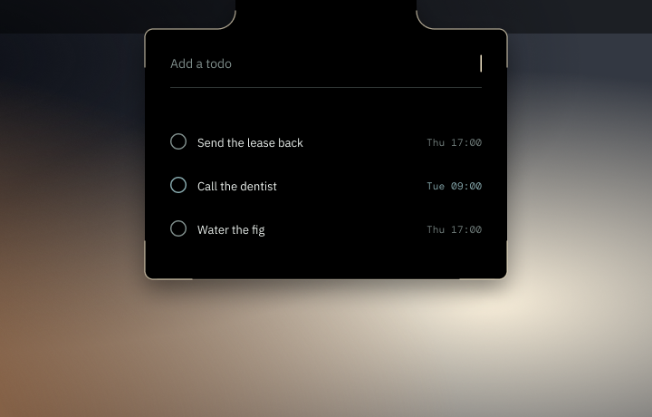
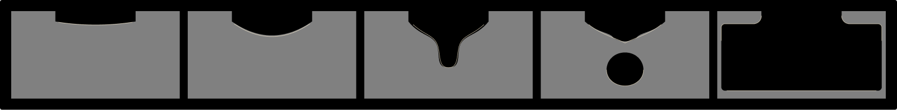
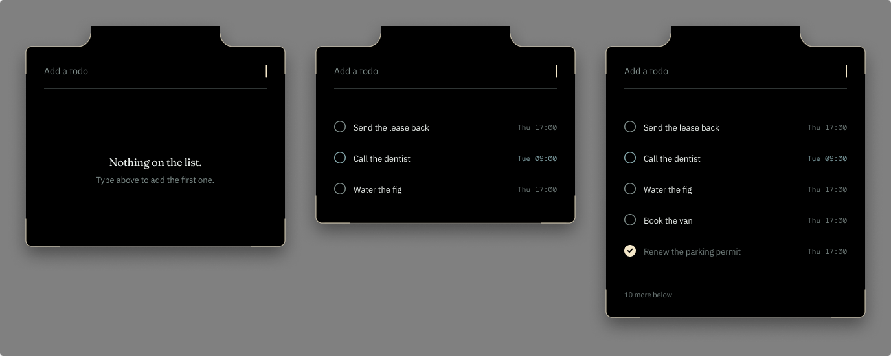

# Sill


A todo app that lives in the MacBook notch.

Collapsed, it is a single hairline of light. Touch it and that line bulges, necks, and pinches
off into a droplet you type into.



## The idea

The panel is **true black and continuous with the bezel**. You are not meant to see a window
that opened. You are meant to see that the black part of the machine got bigger.

Everything else follows from that premise:

- No container. No border, no card, no frame. The silhouette is the only thing defining it.
- Exactly one shadow, and it falls on the wallpaper, never on the panel.
- The panel's outer corners are the notch's own corner radius, and they do not grow as it
  extends, because a physical object keeps its corners when it gets bigger.
- Elevation never uses a lighter surface. A lighter rectangle inside a black panel reads as
  floating in space and reveals the panel as a window. Hierarchy comes from type, spacing and
  hairlines only.

## The morph



The transition is a real metaball, not five keyframes cross faded. Two masses are drawn into
one compositing layer, blurred, then alpha thresholded. Blur spreads the alpha, the threshold
snaps it back to a hard edge, and the values in between become the neck.

Fusion and separation fall out of the physics rather than being drawn. The cove where the panel
meets the notch is not authored anywhere in the code: it is what the threshold produces where
the two masses meet.

It runs at **60fps with 12% CPU**, and **0% when settled**, because the timeline pauses once
the spring has come to rest.

## States



Overflow is told by the list running out under its own boundary and a count in tertiary. Not a
scrollbar, which is chrome this app does not have, and not a fade, which on black over black is
invisible.

## The AI layer

A locally authenticated Claude session parses natural language into a titled todo with a date
and a tag. Three rules govern it:

1. **Never block on the model.** The todo exists the moment you press Return. Enrichment
   decorates something that already works.
2. **Show the parse as editable chips, not prose.** A wrong date is one click to fix, never a
   retyped todo.
3. **Unconfirmed is a visual state.** When the model guessed rather than read, that element
   looks different until you accept or touch it.

Waiting is a meniscus travelling the waterline. There is no spinner anywhere in this product.

## Status

Built and working:

| | |
|---|---|
| Window layer | Notch geometry read live, click through outside the silhouette, no permission prompts |
| Morph | Full four spring metaball, Reduce Motion honoured |
| Capture | Commits on Return, local date parsing, never waits on anything |
| Rows | Three hierarchy levels, no fills, tabular dates |
| Complete | Accent blooms once, five second grace, undo that names the todo |
| Edit and snooze | Inline edit, week strip for dates, snooze with confirmation |
| Keyboard | Arrow keys, Return to edit, Space to complete, S to snooze, Escape to retract |
| Persistence | Atomic writes, survives relaunch |

| AI layer | Local Claude bridge, streaming, editable chips, three failure states |
| Reminders | Held pendant, peek, escalation ceiling, quiet hours, system fallback |

Not built yet: the global hotkey, drag and drop onto the notch, the slash command list, and
the non notch pill fallback.

## Build

Requires Xcode 16.4 or the toolchain recorded in `CLAUDE.md`. There are no dependencies.

```sh
python3 tools/genproj.py                                    # regenerate the project file
xcodebuild -project Sill.xcodeproj -scheme Sill -configuration Release build
```

The Xcode project is **generated** from the source tree rather than hand edited. Add a file,
run `genproj.py`, and it is picked up. `objectVersion` is pinned at 56 so Xcode never offers to
modernise the format.

To install:

Download the disk image from [Releases](https://github.com/collinsadi/sill/releases), open it,
and drag Sill into Applications.

The app is signed with a Developer ID but is **not notarized**, so the first launch needs a
right click and Open rather than a double click. macOS will not offer that path from a double
click alone.

There is no Dock icon and no menu bar item. Click the notch to open, right click it to quit.

To build the installer yourself:

```sh
./tools/makedmg.sh <path-to-Sill.app> build/Sill.dmg
```

## Architecture

Six layers, dependencies pointing downward only. Full detail in `ARCHITECTURE.md`.

```
Views          SwiftUI. Store driven. Window ignorant.
  |
Render         Silhouette, metaball morph, specular edge.
  |
Store          Todos, persistence, undo.     Intelligence (actor)
  |                                          Scheduling   (reminders, escalation)
Window         NSPanel, notch geometry, hit testing. Pure AppKit.
```

Two decisions worth knowing before reading the code:

**The window never resizes.** It sits at the union of the notch and the maximum panel for the
whole session, and a hit mask decides what is clickable. Resizing an `NSPanel` every frame
fights the animation. The mask is fed the same path the renderer draws, so the clickable region
cannot drift from the visible one.

**Focus state lives in `PanelState`, not in the views**, because the key monitor is AppKit and
both have to agree on which row is focused.

## Typefaces

Fraunces for display, IBM Plex Sans for body, DM Mono for anything numeric. None are installed
on a stock macOS system, so they ship with the app rather than being silently substituted.
Licences and attribution in `Sill/Resources/FONTS.md`.

Fraunces is the variable build, set to `SOFT 60`. That axis controls how swollen the terminals
get and it is the entire reason the face was chosen.

## Licence

MIT. See `LICENSE`. Bundled fonts are SIL Open Font Licence 1.1, see `Sill/Resources/OFL.txt`.
